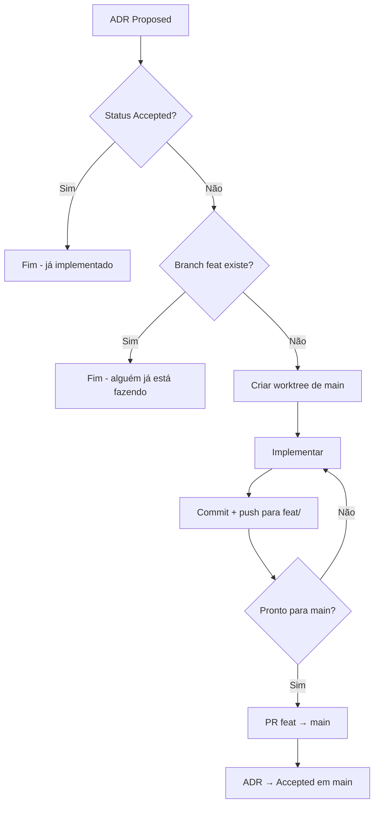

# Concurrent Development Workflow — Guia Completo

## O Problema

Você quer que múltiplos agentes de IA (opencode, Claude Code, Cursor, etc.) trabalhem em paralelo no mesmo repositório. O problema é: se todos compartilham o mesmo diretório de trabalho, um `git checkout` ou `git add` de um agente corrompe o estado do outro. Isso gera conflitos de merge, arquivos sumindo, commits misturados.

## A Solução: `git worktree`

`git worktree` permite que múltiplos branches tenham **diretórios independentes** compartilhando o **mesmo `.git/objects`** (zero duplicação de dados).

```
repo/
├── .git/                     ← compartilhado (objetos, refs)
├── .workspace/
│   ├── feat/lexer/           ← working tree 1 (branch feat/lexer)
│   ├── feat/parser/          ← working tree 2 (branch feat/parser)
│   ├── feat/codegen/         ← working tree 3 (branch feat/codegen)
│   └── feat/integration/     ← working tree 4 (branch feat/integration)
└── src/                      ← working tree 5 (branch main)
```

Cada worktree:
- Tem seu **próprio diretório** — arquivos completamente isolados
- Está num **branch diferente** — sem checkout collisions
- Compartilha `.git/objects` — commits de um aparecem em todos
- Pode fazer `git push`, `git pull`, `git commit` simultaneamente

---

## Passo a Passo Completo

### Fase 0: Setup do Projeto

```bash
git clone git@github.com:seu-org/seu-repo.git
cd seu-repo
git worktree prune
mkdir -p .workspace docs/adr
```

### Fase 1: Proposta — Branch `props/` (proposal)

**NUNCA proponha contratos direto na main.** Crie uma branch de proposta:

```bash
git checkout -b props/nome-da-feature main
```

A branch `props/` contém:
- **ADRs** com status `Proposed` — documentam as decisões de design
- **Contratos/Interfaces** — tipos, structs, funções vazias que as implementações vão seguir
- **AGENTS.md** — regras para os agentes

**1.1 Crie os ADRs**

Cada task independente ganha um ADR. Exemplo de `docs/adr/001-lexer-implementation.md`:

```markdown
# ADR-001: Implementação do Lexer

## Status
Proposed

## Context
Precisamos tokenizar a DSL para processamento pelo parser.

## Decision
Implementar um lexer manual (recursive descent) que produz tokens
com Tipo, Literal, Linha e Coluna. Suporta keywords, identificadores,
strings, números, e operadores (|, /\, ->, :, =).

## Consequences
- Lexer simples sem dependências externas
- Fácil de debugar e estender
- Consistente com a abordagem do "Writing a Compiler in Go"
```

Crie um ADR para cada task independente: `001-lexer.md`, `002-ast.md`, `003-parser.md`, etc.

**1.2 Crie os contratos/interfaces na proposta**

Defina os tipos compartilhados entre os componentes. Exemplo `token/token.go`:

```go
package token

type TokenType string
type Token struct {
    Type    TokenType
    Literal string
    Line    int
    Column  int
}

const (
    ILLEGAL = "ILLEGAL"
    EOF     = "EOF"
    IDENT   = "IDENT"
)

var Keywords = map[string]TokenType{}
func LookupIdent(ident string) TokenType { return IDENT }
```

**1.3 Crie o AGENTS.md na proposta**

```markdown
# Regras para Agentes

## Workflow
1. ADRs estão em docs/adr/ com status Proposed (aguardando aprovação)
2. Contratos estão em token/, ast/ etc — NÃO modifique os contratos
3. Cada feature usa git worktree de main: `git worktree add -b feat/<name> .workspace/feat/<name> main`
4. Agentes trabalham em paralelo em seus worktrees
5. Integração via merge no branch de integração
6. ADRs atualizados para Accepted no PR final

## Commits
- feat:, fix:, docs:, refactor:, test:, chore:

## Código
- Go module: github.com/org/repo
- Packages por diretório
- Testes com `testing` package
- `go vet` obrigatório
- Erros como retorno, não panic
```

**1.4 Commit + Push da proposta**

```bash
git add docs/adr/ token/ AGENTS.md
git commit -m "props: add ADRs 001-003 + contracts for lexer, ast, parser"
git push origin props/nome-da-feature
```

Neste ponto a branch `props/` contém **tudo que é necessário para começar**, mas nada foi implementado ainda. É puro contrato + documentação.

### Fase 2: Aprovação — Merge `props/` → `main`

A proposta é revisada. Se aprovada:

```bash
git checkout main
git merge props/nome-da-feature -m "feat: approve proposal - ADRs 001-003 + contracts"
git push origin main

# Opcional: deletar branch de proposta
git branch -d props/nome-da-feature
git push origin --delete props/nome-da-feature
```

**Agora `main` tem os ADRs + contratos.** O status dos ADRs continua `Proposed` — eles viram `Accepted` só no PR final da implementação.

### Fase 3: Criar Worktrees a partir de `main` (3 segundos)

```bash
git worktree add -b feat/lexer    .workspace/feat/lexer    main
git worktree add -b feat/ast      .workspace/feat/ast      main
git worktree add -b feat/parser   .workspace/feat/parser   main
git worktree add -b feat/semantic .workspace/feat/semantic main
git worktree add -b feat/pipeline .workspace/feat/pipeline main
git worktree add -b feat/codegen  .workspace/feat/codegen  main
```

Cada worktree já nasce com os **contratos no lugar** — `token/token.go`, interfaces, etc. Nenhum agente precisa copiar nada de ninguém.

### Fase 4: Antes de Começar — Verificar se Já Foi Feito

**Cada agente ANTES de implementar:**

1. `git fetch origin`
2. `grep "^## Status" docs/adr/NNN-*.md` — se `Accepted`, já foi implementado. **Pare.**
3. `git branch -r | grep feat/<nome>` — se a branch existe remotamente, alguém já está implementando. **Pare.**
4. `gh pr list --state open --head feat/<nome>` — se tem PR aberto, já está em revisão. **Pare.**
5. Se nada disso existe → **pode começar**



### Fase 5: Implementar + Commitar Progresso

Cada agente implementa no seu worktree isolado. A cada passo completo, commit + push no **próprio branch feat/**. Quando a feature estiver completa e testada, abre PR para main.

Isso permite que outro agente veja a branch remota e **não comece a mesma coisa**.

Exemplo de commits incrementais:
```bash
# Worktree do lexer — branch feat/lexer
git add token/token.go
git commit -m "feat: add TokenType constants and Token struct"
git push origin feat/lexer

git add lexer/lexer.go
git commit -m "feat: add Lexer with NextToken for keywords and identifiers"
git push origin feat/lexer

git add -u
git commit -m "feat: add string/number/operator support to lexer"
git push origin feat/lexer
```

Cadência ideal de commits:
- 1 commit por arquivo novo
- 1 commit por funcionalidade atômica
- `git push` após cada commit — assim a branch remota existe e bloqueia outros agentes

### Fase 6: Merge na Integração + Testes

1. **Diretório** do worktree (via `--dir` ou `--projectPath`)
2. **Branch** em que está
3. **ADR** que implementa (referência ao arquivo em main)
4. **Arquivos** a criar
5. **Comandos finais** (add, commit, push)

Exemplo de prompt para o agente do lexer:
```
Você está em /repo/.workspace/feat/lexer no branch feat/lexer.

Implemente o lexer conforme ADR-001 (docs/adr/001-lexer-implementation.md).

Crie:
- token/token.go (tipos de token + keywords + LookupIdent)
- lexer/lexer.go (Lexer struct + New + NextToken + métodos auxiliares)

Ao finalizar:
git add token/ lexer/
git commit -m "feat: implement lexer with token types"
git push origin feat/lexer
```

Importante: **não compartilhe contexto entre agentes**. Cada um sabe só o que precisa. O merge resolve as conexões.

### Fase 4: Tempo de Execução

Os agentes rodam em paralelo. O tempo total é o **maior tempo individual**, não a soma.

| Agente | Arquivos | Tempo |
|--------|----------|-------|
| Lexer | token/token.go, lexer/lexer.go | ~30s |
| AST | ast/ast.go | ~20s |
| Parser | parser/parser.go (+ copia token+ast) | ~45s |
| Semantic | semantic/semantic.go (+ copia token+ast+parser+lexer) | ~25s |
| Pipeline | pipeline/pipeline.go, pipeline_test.go | ~20s |
| Codegen | codegen/codegen.go, codegen_test.go (+ copia token+ast+lexer+parser) | ~30s |

**Total paralelo: ~45s** (o mais lento)
**Total sequencial: ~170s** (um atrás do outro)

**Ganho real:** ~75% de redução no tempo.

### Fase 5: Merge da Integração (o ponto crítico)

```bash
# Criar worktree de integração
git worktree add -b feat/integration .workspace/feat/integration main

# Merge um por um (NÃO use octopus merge — falha com conflitos)
cd .workspace/feat/integration
git merge feat/lexer -m "feat: merge lexer"
git merge feat/ast -m "feat: merge ast"
git merge feat/parser -m "feat: merge parser"
git merge feat/semantic -m "feat: merge semantic"
git merge feat/pipeline -m "feat: merge pipeline"
git merge feat/codegen -m "feat: merge codegen"
```

**Problema comum:** Conflitos em `ast/ast.go` ou `token/token.go` se dois branches criaram o mesmo arquivo. **Isso NÃO acontece quando os contratos foram aprovados em main primeiro** (Fase 1-2). Se acontecer (porque você pulou a fase de proposta):

```bash
git diff --name-only --diff-filter=U   # ver arquivos conflitados
# Se o conteúdo é o mesmo (só diff de import), aceite qualquer versão:
git checkout --ours ast/ast.go
git add ast/ast.go
git commit -m "feat: merge X (resolve conflito em ast/ast.go)"
```

**Com contratos em main, cada branch cria apenas arquivos NOVOS em seus diretórios — zero conflitos.**

### Fase 6: Build + Testes + Fixes

```bash
go build ./...        # compila tudo
go test ./... -v      # roda testes
go vet ./...          # análise estática

# Se algo quebrar, corrija no branch de integração
# Depois: git add + git commit + git push
```

**Bugs esperados pós-merge (normais):**
1. Interface incompatível — um componente espera `X` mas o outro implementa `Y`
2. Import paths errados — cada branch usou seu próprio `go.mod` path
3. Tipos faltando — um branch assumiu que o outro criaria algo que não criou

**Vantagem:** Você descobre TUDO de uma vez, não um bug por PR sequencial.

**Dica:** Se detectar que um componente está incompleto ou bugado após o merge, **crie uma nova branch feat/fix-X a partir de main**, corrija lá, e faça PR direto para main. Não reabra branches antigas.

### Fase 7: Atualizar ADRs + PR Final

```bash
# Atualizar ADRs de Proposed → Accepted
for adr in docs/adr/*.md; do
  sed -i '' 's/Proposed/Accepted/' "$adr"
done

git add docs/adr/
git commit -m "docs: update ADR status to Accepted"
git push origin feat/integration

# PR final
gh pr create \
  --base main \
  --head feat/integration \
  --title "Feature: descrição do que foi feito" \
  --body "## ADRs

- ADR-001: $(cat docs/adr/001*.md | grep '^# ' | head -1)
- ADR-002: $(cat docs/adr/002*.md | grep '^# ' | head -1)
...

## O que foi implementado

| Componente | Branch | Arquivos |
|------------|--------|----------|
| Lexer | feat/lexer | token/token.go, lexer/lexer.go |
| AST | feat/ast | ast/ast.go |
| ... | ... | ... |

## Build

- \`go build\`: ✅
- \`go test\`: ✅
- \`go vet\`: ✅"
```

---

## AGENTS.md — Para Copiar e Adaptar

Crie este arquivo em `.opencode/rules.md` ou `AGENTS.md` na raiz do projeto:

```markdown
# Regras para Agentes

## Regra de Ouro
**Antes de implementar qualquer coisa, verifique se já foi feito.**

```
1. grep "^## Status" docs/adr/NNN-*.md → "Accepted"? Já foi. Pare.
2. git branch -r | grep feat/<nome> → existe? Alguém já está fazendo. Pare.
3. gh pr list --state open --head feat/<nome> → tem PR? Já está em revisão. Pare.
4. Nada disso? Pode começar.
```

## Workflow
0. Propostas vão para branch `props/` — ADRs + contratos
1. Após aprovação, merge props → main
2. Worktrees a partir de main: `git worktree add -b feat/<name> .workspace/feat/<name> main`
3. Cada agente implementa no seu worktree
4. **Commits incrementais no próprio branch feat/ com push frequente**
5. Outros agentes veem a branch remota e não duplicam trabalho
6. Quando completo + testado → PR feat/ → main
7. ADR vira Accepted no merge do PR

## Commits
- props: para propostas (ADRs + contratos)
- feat: para novas funcionalidades
- fix: para correções
- docs: para documentação
- test: para testes

## Código
- Go module: github.com/org/repo
- Packages por diretório
- Testes unitários com `testing` package
- `go vet` obrigatório antes do push
- Erros como retorno, não panic

## Prompt Padrão para Novos Agentes

Quando for criar um novo agente para implementar uma feature:

1. Leia o ADR correspondente em docs/adr/
2. Crie os arquivos conforme especificado
3. go mod tidy se necessário
4. git add + git commit + git push
5. Não modifique arquivos fora do seu escopo
```

---

## O Que Aprendemos

### ✅ Funciona bem para
- Tarefas que criam **arquivos diferentes** (ex: lexer vs parser vs codegen)
- Tarefas que seguem um **contrato definido** (interfaces conhecidas antes)
- Projetos com **módulos bem isolados** (Go packages, Python modules, Rust crates)
- Quando você quer **PR único** no final, não PRs intermediários

### ❌ Não funciona bem para
- Editar o **mesmo arquivo** concorrentemente (gera conflito no merge)
- Tarefas que dependem **sequencialmente** uma da outra (ex: testar o parser antes de implementar o semantic)
- Quando você não sabe os **contratos/interface** de antemão (vai ter que resolver conflito)

### ⚡ Dicas de Performance
1. **Criar worktrees é instantâneo** (~0.5s cada) — faça todos de uma vez
2. **`git merge` sequencial** (um por um) é mais confiável que octopus merge
3. **Conflitos em arquivos idênticos** (mesmo conteúdo) — `git checkout --ours` resolve
4. **Sempre use `--dir`** nos agentes, nunca `cd` — evita confusão de diretório
5. **Limpe worktrees velhos**: `git worktree prune` + `rm -rf .workspace/*`
6. **Crie contratos em props/ primeiro, depois merge em main** — elimina 100% dos conflitos de merge

### 🔧 Adaptação para outras ferramentas

| Ferramenta | Equivalente ao --dir |
|-----------|---------------------|
| Claude Code | `claude --projectPath .workspace/feat/x` |
| Cursor | `cursor --folder .workspace/feat/x` |
| Aider | `aider .workspace/feat/x` |
| Continue.dev | Configurar workspace no VS Code |
| OpenCode (CLI) | `opencode --dir .workspace/feat/x "<prompt>"` |

### 💾 Caching

O `git worktree` também melhora caching porque:
- Cada worktree tem seu **próprio cache de LSP** (arquivos não mudam externamente)
- O `go build` cacheia objetos compilados por worktree
- O `go.sum` é compartilhado via `.git/objects`

Use `OPENCODE_EXPERIMENTAL_WORKSPACES=true` se estiver usando opencode — ele mantém file watcher + contexto quente por worktree.

---

## Exemplo Comandos Completos (para copiar e colar)

```bash
# === SETUP ===
git clone git@github.com:seu-org/seu-repo.git
cd seu-repo
mkdir -p .workspace docs/adr

# === PROPOSTA (props/) — ADRs + Contratos ===
git checkout -b props/transpiler main
mkdir -p docs/adr token ast

# Cria ADRs
for i in 1 2 3; do
  cat > "docs/adr/00$i-description.md" << ADR
# ADR-00$i: Description

## Status
Proposed

## Context
...

## Decision
...

## Consequences
...
ADR
done

# Cria contratos (interfaces/tipos compartilhados)
cat > token/token.go << 'EOF'
package token
type TokenType string
type Token struct { Type TokenType; Literal string }
EOF

cat > AGENTS.md << 'EOF'
# Regras para Agentes
...
EOF

git add -A
git commit -m "props: add ADRs 001-003 + contracts + AGENTS.md"
git push origin props/transpiler

# === APROVAÇÃO → MAIN ===
git checkout main
git merge props/transpiler -m "feat: approve proposal - ADRs + contracts"
git push origin main
git branch -d props/transpiler

# === CRIAR WORKTREES (de main) ===
for branch in lexer ast parser; do
  git worktree add -b "feat/$branch" ".workspace/feat/$branch" main
done

# === LANÇAR AGENTES (paralelo) — cada um verifica antes ===
# Prompt do agente:
# "1. Verifique se feat/lexer já existe remoto (git branch -r | grep feat/lexer)
#  2. Verifique se ADR-001 já está Accepted (grep Status docs/adr/001-*.md)
#  3. Se nada, implemente no worktree .workspace/feat/lexer
#  4. Commit incremental a cada arquivo completo com push"

# Terminal 1
opencode --dir .workspace/feat/lexer "Implemente lexer conforme ADR-001..."
# Terminal 2
opencode --dir .workspace/feat/ast "Implemente AST conforme ADR-002..."
# Terminal 3
opencode --dir .workspace/feat/parser "Implemente parser conforme ADR-003..."

# === MERGE NA INTEGRAÇÃO + TESTES ===
git worktree add -b feat/integration .workspace/feat/integration main
cd .workspace/feat/integration
for branch in lexer ast parser; do
  git merge "feat/$branch" -m "feat: merge $branch"
done
go build ./... && go test ./... -v && go vet ./... || echo "Corrija os erros acima"

# === ATUALIZAR ADRs (Proposed → Accepted) + PR FINAL ===
for adr in docs/adr/*.md; do
  sed -i '' 's/Proposed/Accepted/' "$adr"
done
git add -A
git commit -m "feat: integrate all components and accept ADRs"
git push origin feat/integration
gh pr create --base main --head feat/integration --title "..." --body "..."
```