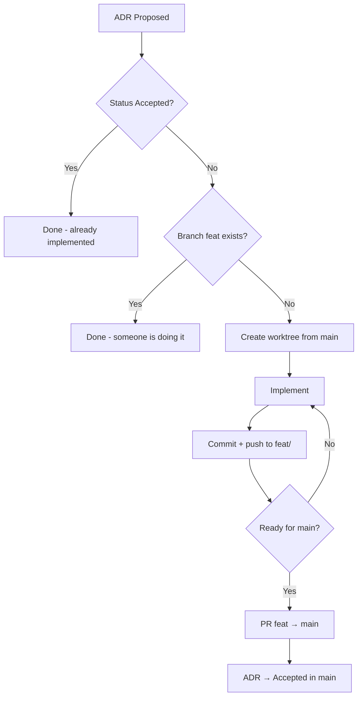

# Concurrent Development Workflow — Complete Guide

## The Problem

You want multiple AI agents (opencode, Claude Code, Cursor, etc.) to work in parallel on the same repository. The problem: if they all share the same working directory, one agent's `git checkout` or `git add` corrupts another's state. This causes merge conflicts, missing files, and mixed commits.

## The Solution: `git worktree`

`git worktree` allows multiple branches to have **independent directories** while sharing the **same `.git/objects`** (zero data duplication).

```
repo/
├── .git/                     ← shared (objects, refs)
├── .workspace/
│   ├── feat/lexer/           ← working tree 1 (branch feat/lexer)
│   ├── feat/parser/          ← working tree 2 (branch feat/parser)
│   ├── feat/codegen/         ← working tree 3 (branch feat/codegen)
│   └── feat/integration/     ← working tree 4 (branch feat/integration)
└── src/                      ← working tree 5 (branch main)
```

Each worktree:
- Has its **own directory** — completely isolated files
- Is on a **different branch** — no checkout collisions
- Shares `.git/objects` — commits from one are visible in all
- Can `git push`, `git pull`, `git commit` simultaneously

---

## Step-by-Step Guide

### Phase 0: Project Setup

```bash
git clone git@github.com:your-org/your-repo.git
cd your-repo
git worktree prune
mkdir -p .workspace docs/adr
```

### Phase 1: Proposal — `props/` Branch

**NEVER propose contracts directly on main.** Create a proposal branch:

```bash
git checkout -b props/feature-name main
```

The `props/` branch contains:
- **ADRs** with status `Proposed` — document design decisions
- **Contracts/Interfaces** — types, structs, empty functions that implementations will follow
- **AGENTS.md** — rules for agents

**1.1 Create the ADRs**

Each independent task gets an ADR. Example `docs/adr/001-lexer-implementation.md`:

```markdown
# ADR-001: Lexer Implementation

## Status
Proposed

## Context
We need to tokenize the DSL for parser processing.

## Decision
Implement a manual recursive descent lexer producing tokens
with Type, Literal, Line, and Column. Supports keywords, identifiers,
strings, numbers, and operators (|, /\, ->, :, =).

## Consequences
- Simple lexer with no external dependencies
- Easy to debug and extend
- Consistent with the "Writing a Compiler in Go" approach
```

Create one ADR per independent task: `001-lexer.md`, `002-ast.md`, `003-parser.md`, etc.

**1.2 Create contracts/interfaces in the proposal**

Define shared types between components. Example `token/token.go`:

```go
package token

type TokenType string
type Token struct {
    Type    TokenType
    Literal string
    Line    int
    Column  int
}

const (
    ILLEGAL = "ILLEGAL"
    EOF     = "EOF"
    IDENT   = "IDENT"
)

var Keywords = map[string]TokenType{}
func LookupIdent(ident string) TokenType { return IDENT }
```

**1.3 Create AGENTS.md in the proposal**

```markdown
# Agent Rules

## Workflow
1. ADRs are in docs/adr/ with status Proposed (awaiting approval)
2. Contracts are in token/, ast/ etc — DO NOT modify the contracts
3. Each feature uses a git worktree from main: `git worktree add -b feat/<name> .workspace/feat/<name> main`
4. Agents work in parallel in their own worktrees
5. Integration via merge in the integration branch
6. ADRs updated to Accepted in the final PR

## Commits
- feat:, fix:, docs:, refactor:, test:, chore:

## Code
- Go module: github.com/org/repo
- One package per directory
- Tests with `testing` package
- `go vet` required
- Errors as return values, not panic
```

**1.4 Commit + Push the proposal**

```bash
git add docs/adr/ token/ AGENTS.md
git commit -m "props: add ADRs 001-003 + contracts for lexer, ast, parser"
git push origin props/feature-name
```

At this point the `props/` branch contains **everything needed to start**, but nothing is implemented yet. Pure contract + documentation.

### Phase 2: Approval — Merge `props/` → `main`

The proposal is reviewed. If approved:

```bash
git checkout main
git merge props/feature-name -m "feat: approve proposal - ADRs 001-003 + contracts"
git push origin main

# Optional: delete the proposal branch
git branch -d props/feature-name
git push origin --delete props/feature-name
```

**Now `main` has the ADRs + contracts.** ADR status remains `Proposed` — they only become `Accepted` in the final implementation PR.

### Phase 3: Create Worktrees from `main` (3 seconds)

```bash
git worktree add -b feat/lexer    .workspace/feat/lexer    main
git worktree add -b feat/ast      .workspace/feat/ast      main
git worktree add -b feat/parser   .workspace/feat/parser   main
git worktree add -b feat/semantic .workspace/feat/semantic main
git worktree add -b feat/pipeline .workspace/feat/pipeline main
git worktree add -b feat/codegen  .workspace/feat/codegen  main
```

Each worktree is born with **contracts already in place** — `token/token.go`, interfaces, etc. No agent needs to copy anything from anyone.

### Phase 4: Before Starting — Check If Already Done

**Every agent BEFORE implementing:**

1. `git fetch origin`
2. `grep "^## Status" docs/adr/NNN-*.md` — if `Accepted`, already implemented. **Stop.**
3. `git branch -r | grep feat/<name>` — if remote branch exists, someone is already implementing. **Stop.**
4. `gh pr list --state open --head feat/<name>` — if PR is open, it's already under review. **Stop.**
5. Nothing found? → **Start**



### Phase 5: Implement + Commit Progress

Each agent implements in its isolated worktree. After each complete step, commit + push to the **own `feat/` branch**. When the feature is complete and tested, open a PR to main.

This lets other agents see the remote branch and **not start the same thing**.

Example of incremental commits:
```bash
# Lexer worktree — branch feat/lexer
git add token/token.go
git commit -m "feat: add TokenType constants and Token struct"
git push origin feat/lexer

git add lexer/lexer.go
git commit -m "feat: add Lexer with NextToken for keywords and identifiers"
git push origin feat/lexer

git add -u
git commit -m "feat: add string/number/operator support to lexer"
git push origin feat/lexer
```

Ideal commit cadence:
- 1 commit per new file
- 1 commit per atomic feature
- `git push` after every commit — this makes the remote branch visible and blocks other agents

### Phase 6: Integration Merge + Tests

```bash
# Create integration worktree
git worktree add -b feat/integration .workspace/feat/integration main

# Merge one by one (DO NOT use octopus merge — it fails with conflicts)
cd .workspace/feat/integration
git merge feat/lexer -m "feat: merge lexer"
git merge feat/ast -m "feat: merge ast"
git merge feat/parser -m "feat: merge parser"
git merge feat/semantic -m "feat: merge semantic"
git merge feat/pipeline -m "feat: merge pipeline"
git merge feat/codegen -m "feat: merge codegen"
```

**Common problem:** Conflicts in `ast/ast.go` or `token/token.go` if two branches created the same file. **This does NOT happen when contracts were approved in main first** (Phase 1-2). If it happens (because you skipped the proposal phase):

```bash
git diff --name-only --diff-filter=U   # see conflicted files
# If content is the same (just import diffs), accept either version:
git checkout --ours ast/ast.go
git add ast/ast.go
git commit -m "feat: merge X (resolve conflict in ast/ast.go)"
```

**With contracts in main, each branch only creates NEW files in its own directories — zero conflicts.**

### Phase 7: Build + Test + Fixes

```bash
go build ./...        # compile everything
go test ./... -v      # run tests
go vet ./...          # static analysis

# If something breaks, fix it in the integration branch
# Then: git add + git commit + git push
```

**Expected post-merge bugs (normal):**
1. Interface mismatch — one component expects `X` but another implements `Y`
2. Wrong import paths — each branch used its own `go.mod` path
3. Missing types — a branch assumed another would create something it didn't

**Advantage:** You discover EVERYTHING at once, not one bug per sequential PR.

**Tip:** If you detect a component is incomplete or buggy after the merge, **create a new branch feat/fix-X from main**, fix it there, and PR directly to main. Don't reopen old branches.

### Phase 8: Update ADRs + Final PR

```bash
# Update ADRs from Proposed → Accepted
for adr in docs/adr/*.md; do
  sed -i '' 's/Proposed/Accepted/' "$adr"
done

git add docs/adr/
git commit -m "docs: update ADR status to Accepted"
git push origin feat/integration

# Final PR
gh pr create \
  --base main \
  --head feat/integration \
  --title "Feature: description of what was done" \
  --body "## ADRs

- ADR-001: $(cat docs/adr/001*.md | grep '^# ' | head -1)
- ADR-002: $(cat docs/adr/002*.md | grep '^# ' | head -1)
...

## What was implemented

| Component | Branch | Files |
|-----------|--------|-------|
| Lexer | feat/lexer | token/token.go, lexer/lexer.go |
| AST | feat/ast | ast/ast.go |
| ... | ... | ... |

## Build

- \`go build\`: ✅
- \`go test\`: ✅
- \`go vet\`: ✅"
```

---

## AGENTS.md — Copy and Adapt

Create this file in `.opencode/rules.md` or `AGENTS.md` at the project root:

```markdown
# Agent Rules

## Golden Rule
**Before implementing anything, check it hasn't been done yet.**

```
1. grep "^## Status" docs/adr/NNN-*.md → "Accepted"? Done. Stop.
2. git branch -r | grep feat/<name> → exists? Someone is doing it. Stop.
3. gh pr list --state open --head feat/<name> → has PR? Already under review. Stop.
4. None of the above? Go ahead.
```

## Workflow
0. Proposals go to `props/` branch — ADRs + contracts
1. After approval, merge props → main
2. Worktrees from main: `git worktree add -b feat/<name> .workspace/feat/<name> main`
3. Each agent implements in its own worktree
4. **Incremental commits on own feat/ branch with frequent push**
5. Other agents see the remote branch and don't duplicate work
6. When complete + tested → PR feat/ → main
7. ADR becomes Accepted on PR merge

## Commits
- props: for proposals (ADRs + contracts)
- feat: for new features
- fix: for bug fixes
- docs: for documentation
- test: for tests

## Code
- Go module: github.com/org/repo
- One package per directory
- Unit tests with `testing` package
- `go vet` required before push
- Errors as return values, not panic

## Default Agent Prompt

When creating a new agent to implement a feature:

1. Read the corresponding ADR in docs/adr/
2. Create files as specified
3. go mod tidy if needed
4. git add + git commit + git push
5. Don't modify files outside your scope
```

---

## What We Learned

### ✅ Works well for
- Tasks that create **different files** (e.g. lexer vs parser vs codegen)
- Tasks following a **defined contract** (interfaces known upfront)
- Projects with **well-isolated modules** (Go packages, Python modules, Rust crates)
- When you want a **single PR** at the end, not intermediate PRs

### ❌ Doesn't work well for
- Editing the **same file** concurrently (causes merge conflicts)
- Tasks that depend **sequentially** on each other (e.g. testing the parser before implementing semantic analysis)
- When you don't know the **contracts/interfaces** in advance (you'll have to resolve conflicts)

### ⚡ Performance Tips
1. **Creating worktrees is instant** (~0.5s each) — do them all at once
2. **Sequential `git merge`** (one by one) is more reliable than octopus merge
3. **Conflicts in identical files** (same content) — `git checkout --ours` resolves it
4. **Always use `--dir`** with agents, never `cd` — avoids directory confusion
5. **Clean old worktrees**: `git worktree prune` + `rm -rf .workspace/*`
6. **Create contracts in props/ first, then merge to main** — eliminates 100% of merge conflicts

### 🔧 Adapting for Other Tools

| Tool | Equivalent to --dir |
|------|-------------------|
| Claude Code | `claude --projectPath .workspace/feat/x` |
| Cursor | `cursor --folder .workspace/feat/x` |
| Aider | `aider .workspace/feat/x` |
| Continue.dev | Configure workspace in VS Code |
| OpenCode (CLI) | `opencode --dir .workspace/feat/x "<prompt>"` |

### 💾 Caching

`git worktree` also improves caching because:
- Each worktree has its **own LSP cache** (files don't change externally)
- `go build` caches compiled objects per worktree
- `go.sum` is shared via `.git/objects`

Use `OPENCODE_EXPERIMENTAL_WORKSPACES=true` if using opencode — it keeps file watcher + hot context per worktree.

---

## Complete Command Example (Copy and Paste)

```bash
# === SETUP ===
git clone git@github.com:your-org/your-repo.git
cd your-repo
mkdir -p .workspace docs/adr

# === PROPOSAL (props/) — ADRs + Contracts ===
git checkout -b props/transpiler main
mkdir -p docs/adr token ast

# Create ADRs
for i in 1 2 3; do
  cat > "docs/adr/00$i-description.md" << ADR
# ADR-00$i: Description

## Status
Proposed

## Context
...

## Decision
...

## Consequences
...
ADR
done

# Create contracts (shared types/interfaces)
cat > token/token.go << 'EOF'
package token
type TokenType string
type Token struct { Type TokenType; Literal string }
EOF

cat > AGENTS.md << 'EOF'
# Agent Rules
...
EOF

git add -A
git commit -m "props: add ADRs 001-003 + contracts + AGENTS.md"
git push origin props/transpiler

# === APPROVAL → MAIN ===
git checkout main
git merge props/transpiler -m "feat: approve proposal - ADRs + contracts"
git push origin main
git branch -d props/transpiler

# === CREATE WORKTREES (from main) ===
for branch in lexer ast parser; do
  git worktree add -b "feat/$branch" ".workspace/feat/$branch" main
done

# === LAUNCH AGENTS (parallel) — each checks before starting ===
# Agent prompt:
# "1. Check if feat/lexer remote exists (git branch -r | grep feat/lexer)
#  2. Check if ADR-001 is already Accepted (grep Status docs/adr/001-*.md)
#  3. If nothing, implement in worktree .workspace/feat/lexer
#  4. Incremental commits per file with push"

# Terminal 1
opencode --dir .workspace/feat/lexer "Implement lexer per ADR-001..."
# Terminal 2
opencode --dir .workspace/feat/ast "Implement AST per ADR-002..."
# Terminal 3
opencode --dir .workspace/feat/parser "Implement parser per ADR-003..."

# === INTEGRATION MERGE + TESTS ===
git worktree add -b feat/integration .workspace/feat/integration main
cd .workspace/feat/integration
for branch in lexer ast parser; do
  git merge "feat/$branch" -m "feat: merge $branch"
done
go build ./... && go test ./... -v && go vet ./... || echo "Fix errors above"

# === UPDATE ADRs (Proposed → Accepted) + FINAL PR ===
for adr in docs/adr/*.md; do
  sed -i '' 's/Proposed/Accepted/' "$adr"
done
git add -A
git commit -m "feat: integrate all components and accept ADRs"
git push origin feat/integration
gh pr create --base main --head feat/integration --title "..." --body "..."
```